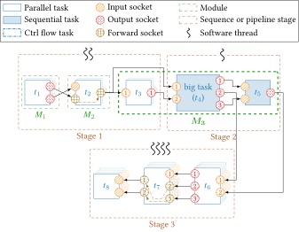

# PGFLibraryAFF3CT

This is a TikZ library to draw *beautiful* AFF3CT graphs in LaTeX ;-).

An example of use is given in the `examples/sequence_chain.tex` file.

To compile this example, you simply need to call `pdflatex` on it:
```bash
cd examples
pdflatex sequence_chain.tex
```

It will produce the following graph.



**Enjoy!**