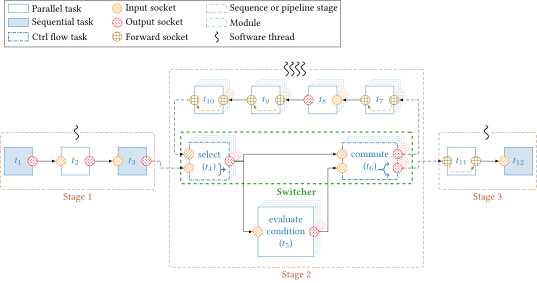

# PGFLibraryAFF3CT

This is a TikZ library to draw *beautiful* AFF3CT graphs in LaTeX ;-).

Some examples of use are given in the `examples` folder and they are detailed 
in the following sections.

## `sequence_chain.tex`

To compile this example, you need to call `pdflatex` on it:
```bash
pdflatex sequence_chain.tex
```

It will produce the following graph.


## `while_loop.tex`

To compile this example, you need to call `pdflatex` on it:
```bash
pdflatex while_loop.tex
```

It will produce the following graph.



Enjoy!